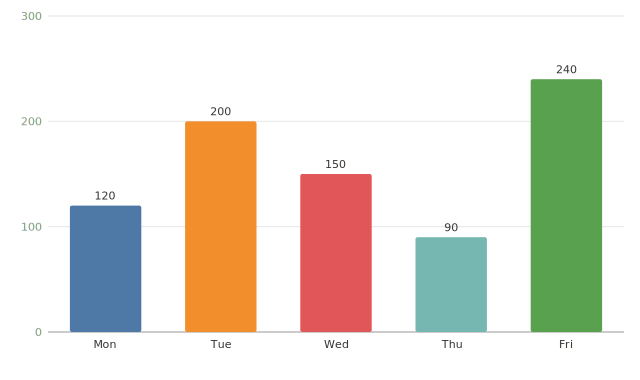
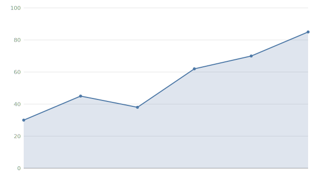
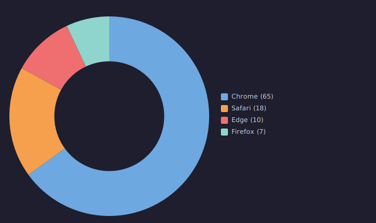

# mooncharts

[](https://github.com/pxgt/mooncharts/actions/workflows/ci.yml)

Lightweight, dependency-free **SVG charting for [MoonBit](https://www.moonbitlang.com/)**.
Turn typed data into standalone SVG documents you can drop into a web page, a
report, or a file — bar, line, area, pie/donut and scatter charts, plus
multi-series line and grouped bar charts, out of the box.

Because MoonBit compiles to JS, Wasm and native, the same chart code can run in
the browser or generate static SVG on the backend.

<p>
  
  
  
</p>

> These images are real SVG output from the library. See `examples/interactive.html`
> for a live, in-browser demo.

## Features

- Eight chart types: bar, line, area, pie, donut, scatter, multi-series line, grouped bar
- Nicely rounded value axes with gridlines (Heckbert "nice numbers")
- Light / dark themes and custom color palettes
- Reusable SVG primitives — compose your own shapes
- Typed, defaulted configuration (no stringly-typed option bags)
- Zero dependencies beyond `moonbitlang/core`
- Snapshot-tested, with a runnable browser gallery

## Install

```bash
moon add Xpeng/mooncharts
```

Then import it in your package's `moon.pkg`:

```
import {
  "Xpeng/mooncharts",
}
```

## Quick start

```mbt check
///|
test {
  let svg = @mooncharts.bar_chart(
    [("Q1", 12.0), ("Q2", 19.0), ("Q3", 8.0), ("Q4", 15.0)],
    title="Quarterly Revenue",
  )
  // `svg` is a complete, standalone SVG document string.
  inspect(svg.has_prefix("<svg"), content="true")
  inspect(svg.contains("Quarterly Revenue"), content="true")
}
```

Write the returned string to a `.svg` file, or embed it directly in an HTML page.

## Chart types

| Function | Data shape | Notes |
|----------|------------|-------|
| `bar_chart` | `Array[(String, Double)]` | vertical bars with value + category labels |
| `line_chart` | `Array[(Double, Double)]` | XY line with point markers |
| `area_chart` | `Array[(Double, Double)]` | line with the region beneath it filled |
| `pie_chart` | `Array[(String, Double)]` | pie, or donut via `donut=0.0..1.0` |
| `scatter_chart` | `Array[(Double, Double)]` | XY scatter, configurable point `radius` |
| `line_chart_multi` | `Array[(String, Array[(Double, Double)])]` | several named line series + legend |
| `bar_chart_grouped` | `Array[String]`, `Array[(String, Array[Double])]` | grouped bars per category + legend |

All chart functions share optional `title?`, `width?`, `height?` and `theme?` parameters.

## Theming

Every chart accepts an optional `theme?`. Use the built-in light (default) or
dark theme, or swap the series palette:

```mbt check
///|
test {
  let dark = @mooncharts.bar_chart(
    [("Q1", 12.0), ("Q2", 19.0)],
    theme=@mooncharts.Theme::dark(),
  )
  inspect(dark.contains("#1e1e2e"), content="true") // dark background

  let custom = @mooncharts.Theme::light().with_palette(["#ff5733", "#33c1ff"])
  let svg = @mooncharts.bar_chart([("A", 1.0), ("B", 2.0)], theme=custom)
  inspect(svg.contains("#ff5733"), content="true")
}
```

## Gallery

Run the bundled example to generate an HTML page showing every chart type:

```bash
moon run cmd/main > gallery.html
# then open gallery.html in your browser
```

## Live interactive demo

`examples/interactive.html` runs mooncharts **in the browser**: the library is
compiled to JavaScript and re-renders charts live as you switch chart types,
drag data sliders, or toggle the dark theme. The `web/` package exposes a
`render` function to JS via `link.js.exports`; rebuild the bundle with:

```bash
moon build --target js --release
cp _build/js/release/build/web/web.js examples/mooncharts.js
```

Then open `examples/interactive.html` in a browser.

## License

[Apache-2.0](LICENSE).
